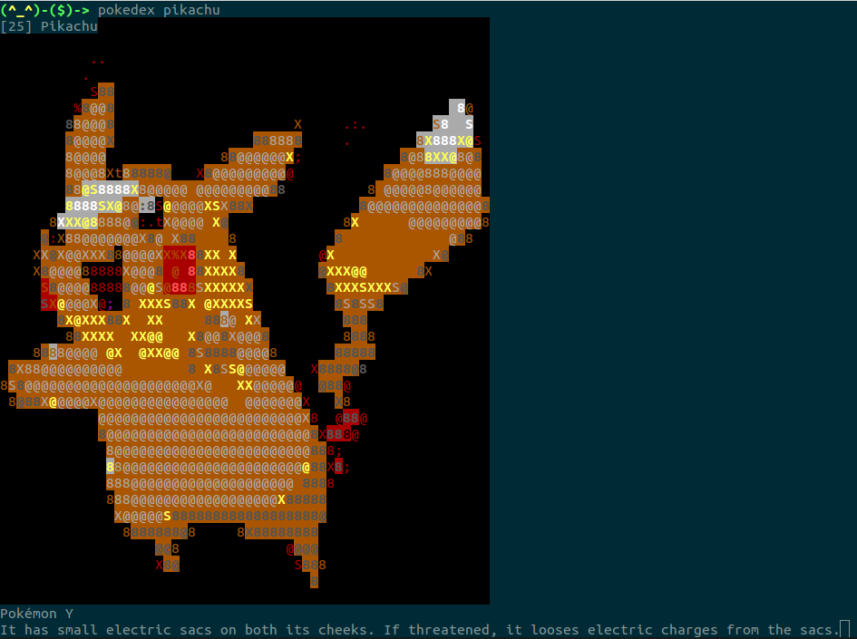

# Pokédex
A command line pokedex that displays a picture and shows a pokedex entry about the pokemon.

Requires an internet connection.

To install, do:

```bash
chmod +x install.sh
./install.sh
```

Shows a random pokemon by default. Only displays images for the first 150 pokemon.

Usage: `pokedex [pokemon name]`


